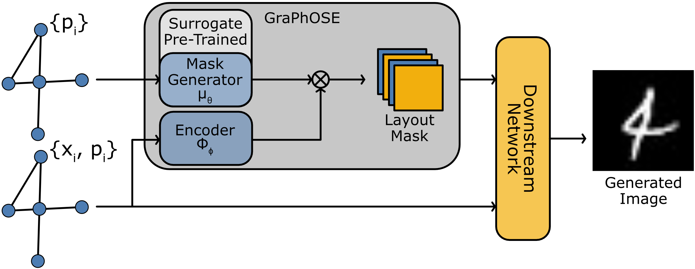
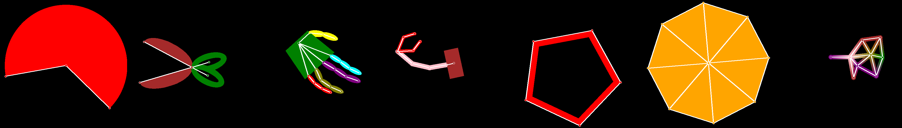

# Object-Centric Relational Representations for Image Generation (TMLR)

[](https://openreview.net/forum?id=7kWjB9zW90)
[](https://openreview.net/pdf?id=7kWjB9zW90)
[](https://arxiv.org/abs/2303.14681)

This repository contains the code for the reproducibility of the experiments presented in the paper "Object-Centric Relational Representations for Image Generation" (TMLR). 
We propose *GraPhOSE*: a framework, based on graph neural networks, to condition the generation of images with an arbitrary number of objects. This framework allows for the joint conditioning of each object's structural arrangement and semantic properties.

**Authors**: [Luca Butera](mailto:luca.butera@usi.ch), Andrea Cini, Alberto Ferrante, Cesare Alippi

---

## GraPhOSE in a nutshell

Conditioning image generation on specific features of the desired output is a key ingredient of modern generative models. However, existing approaches lack a general and unified way of representing structural and semantic conditioning at diverse granularity levels. This paper explores a novel method to condition image generation, based on object-centric relational representations. In particular, we propose a methodology to condition the generation of objects in an image on the attributed graph representing their structure and the associated semantic information. We show that such architectural biases entail properties that facilitate the manipulation and conditioning of the generative process and allow for regularizing the training procedure. The proposed conditioning framework is implemented by means of a neural network that learns to generate a 2D, multi-channel, layout mask of the objects, which can be used as a soft inductive bias in the downstream generative task. We also propose a novel benchmark for image generation consisting of a synthetic dataset of images paired with their relational representation.


Our framework, in the figure, consists of two networks: the mask generator, which takes the pose-graph (containing only geometric properties) as input, and the encoder, which takes the pose-graph with semantic attributes. These two models' outputs are then combined to produce a 2D multi-channel layout mask that can be used to condition a downstream generative model. In this case it is a Generative Adversarial Network.


Sample of the different objects that can be generated in our Pose-Representable Objects (PRO) dataset. Each object can be rendered starting from a corresponding attributed pose-graph, which in turn is randomly generated given a set of object specific constraints. Synthetic images can contain more than one object at once.

---

## Documentation
All commands are meant to be run from the project's root folder.
### Installation
Install the [conda](https://conda.io/projects/conda/en/latest/index.html) package manager and run
```sh
conda env create -f environment_<device>.yml
```
where `device` is either `cpu` (Linux no GPU or Intel MacOS), `cuda` (Linux with GPU) or `mps` (Apple Silicon MacOS) depending on your platform.

### Model Training
First activate the environment with
```sh
conda activate graphose
```
then run
```sh
python main.py <options>
```
#### Pre-training
**Mask Generator Pre-train**
```sh
python main.py +datamodule=pose_mask +model=mask +predictor=mask
```
Checkpoint paths can be retrieved under `outputs/<ID>/checkpoints`. 

#### PRO Dataset
**GraPhOSE**
```sh
python main.py +datamodule=objects +model=graphose_gan +predictor=gan \
               +predictor.low_lr_mul=0.5 trainer.max_epochs=300 monitor=val/fid \
               +predictor.pretrain=<pretrained-checkpoint-absolute-path>
```
**No Pre-train GraPhOSE**
```sh
python main.py +datamodule=objects +model=graphose_gan +predictor=gan \
               +predictor.low_lr_mul=1.0 trainer.max_epochs=300 monitor=val/fid
```
**No Mask Learning GraPhOSE**
```sh
python main.py +datamodule=objects +model=graphose_nomask_gan +predictor=gan \
               trainer.max_epochs=300 monitor=val/fid
```
**Non Relational Baseline**
```sh
python main.py +datamodule=objects +model=baseline_gan +predictor=gan \
               trainer.max_epochs=300 monitor=val/fid
```

#### Additional options
* Prepend `GRAPHOSE_BIG_ARCHITECTURES=1` and replace `+model=<model>_gan` with `+model=<model>_biggan` to train the alternative downstream generator.
* Add option `trainer.gpus=1` to train on a single GPU.
* Set `datamodule.num_workers` to select the number of workers for data loading.
* Add `+predictor.accumulate_gradient=<n>` and `datamodule.batch_size=<64/n>` to train on batch sizes that do not fit in memory.
* Use `datamodule.resolution=64` to train for 64x64 resolution (works also for pre-training).
* In generale, options can be added with `+<option>=<value>`. See the `config` folder to inspect config files and the classes they refer to. Possible options correspond to parameter names in the respective target classes. See [hydra](https://hydra.cc/docs/1.2/intro/) for more information.

## Bibtex reference

If you find this code useful please consider to cite our paper:

```
@article{
butera2024objectcentric,
title={Object-Centric Relational Representations for Image Generation},
author={Luca Butera and Andrea Cini and Alberto Ferrante and Cesare Alippi},
journal={Transactions on Machine Learning Research},
issn={2835-8856},
year={2024},
url={https://openreview.net/forum?id=7kWjB9zW90},
note={}
}
```